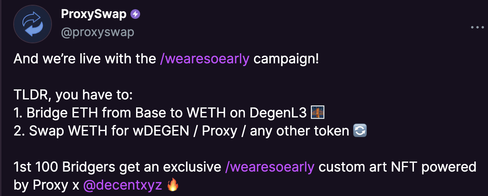

---
layout:
  title:
    visible: true
  description:
    visible: false
  tableOfContents:
    visible: true
  outline:
    visible: true
  pagination:
    visible: true
---

# /wearesoearly Campaign

[**Bridge ETH to DL3 via Decent**](wearesoearly-campaign/bridge-eth-via-decent.md) to get a chance on winning a custom art NFT


[bridge-eth-via-decent.md](wearesoearly-campaign/bridge-eth-via-decent.md)


<figure><figcaption>
<a href="https://warpcast.com/proxyswap/0x08d988f2">ttps://warpcast.com/proxyswap/0x08d988f2</a>
</figcaption></figure>
